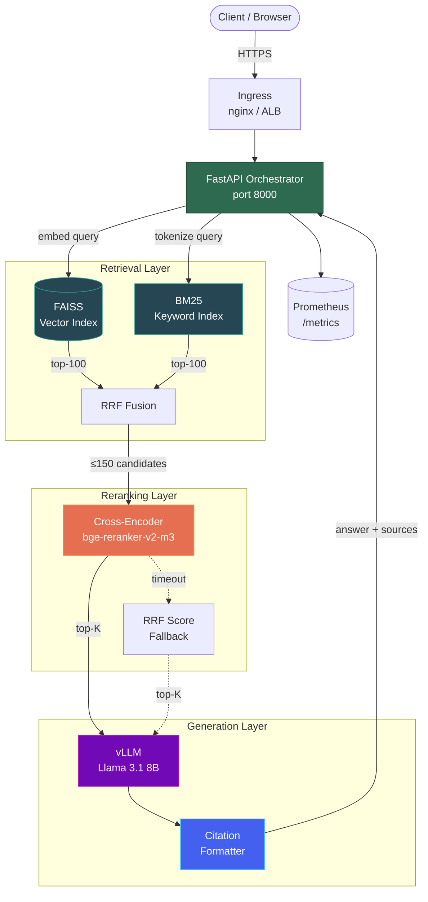
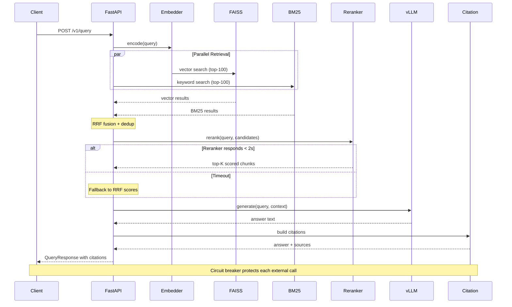
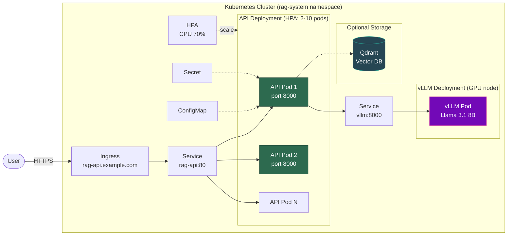

# RAG Enterprise Document Assistant

Production-grade Retrieval-Augmented Generation system with hybrid retrieval,
cross-encoder reranking, citation support, and Kubernetes deployment.

## Architecture

### System Overview



### RAG Query Pipeline



### Kubernetes Deployment



## Quick Start

```bash
# 1. Clone and install
git clone <repo> && cd rag-enterprise
pip install -r requirements.txt

# 2. Run locally (dummy LLM, no GPU needed)
RAG_USE_DUMMY_LLM=true python -m uvicorn src.api.app:app --reload

# 3. Ingest a document
curl -X POST http://localhost:8000/v1/ingest \
  -H "Content-Type: application/json" \
  -d '{"text": "Kubernetes automates deployment...", "filename": "k8s.pdf"}'

# 4. Query
curl -X POST http://localhost:8000/v1/query \
  -H "Content-Type: application/json" \
  -d '{"query": "How does Kubernetes work?", "top_k": 5}'

# 5. Run evaluation
./scripts/backtest.sh
```

## Docker

```bash
# API only (CPU, dummy LLM)
docker compose up api

# Full stack with GPU
docker compose --profile gpu up

# With Qdrant
docker compose --profile qdrant up
```

## Kubernetes

```bash
# Kustomize
kubectl apply -k deploy/k8s/base/

# Helm
helm install rag deploy/helm/rag-assistant/ \
  --set secrets.apiKey=my-secret-key \
  --set vllm.enabled=true
```

## Project Structure

```
rag-enterprise/
├── src/
│   ├── api/          # FastAPI app, routes, pipeline orchestrator
│   ├── chunking/     # Recursive, semantic, fixed-overlap chunkers
│   ├── retrieval/    # FAISS, BM25, hybrid retriever, embeddings
│   ├── reranker/     # Cross-encoder reranker with RRF fallback
│   ├── citation/     # Citation formatter for LLM prompts
│   ├── llm/          # vLLM client (OpenAI-compatible)
│   ├── models/       # Pydantic schemas
│   ├── utils/        # Logging, circuit breakers, retries
│   └── config.py     # All settings via environment variables
├── deploy/
│   ├── k8s/          # Kubernetes manifests + kustomize
│   └── helm/         # Helm chart with full templating
├── evaluation/       # Backtesting framework
├── docs/             # Design decisions, incident retrospectives
├── scripts/          # backtest.sh, utilities
└── tests/            # Unit and integration tests
```

## Configuration

All settings are configurable via environment variables with the `RAG_` prefix.
See `src/config.py` for the complete list with defaults.

| Variable | Default | Description |
|----------|---------|-------------|
| `RAG_CHUNK_STRATEGY` | `recursive` | `recursive`, `semantic`, or `fixed_overlap` |
| `RAG_CHUNK_SIZE` | `512` | Tokens per chunk |
| `RAG_CHUNK_OVERLAP` | `128` | Overlap tokens between chunks |
| `RAG_VECTOR_BACKEND` | `faiss` | `faiss` or `qdrant` |
| `RAG_RERANKER_ENABLED` | `true` | Enable cross-encoder reranking |
| `RAG_LLM_BASE_URL` | `http://vllm:8000/v1` | vLLM endpoint |
| `RAG_USE_DUMMY_LLM` | `true` | Use mock LLM for testing |

## API Usage Examples

All examples assume the server is running at `http://localhost:8000`.
Open the interactive Swagger UI at [http://localhost:8000/docs](http://localhost:8000/docs).

### Ingest a document

```bash
curl -s -X POST http://localhost:8000/v1/ingest \
  -H "Content-Type: application/json" \
  -d '{
    "text": "Kubernetes is an open-source container orchestration platform. It automates deployment, scaling, and management of containerized applications. The control plane consists of the API server, etcd, scheduler, and controller manager.",
    "filename": "k8s_architecture.pdf",
    "title": "Kubernetes Architecture Guide",
    "chunk_strategy": "recursive",
    "chunk_size": 256,
    "chunk_overlap": 64
  }' | python -m json.tool
```

Response:
```json
{
    "doc_id": "a1b2c3d4-5678-9abc-def0-1234567890ab",
    "num_chunks": 2,
    "chunk_strategy": "recursive",
    "message": "Ingestion successful"
}
```

### Query with citations

```bash
curl -s -X POST http://localhost:8000/v1/query \
  -H "Content-Type: application/json" \
  -d '{
    "query": "What are the components of the Kubernetes control plane?",
    "top_k": 3,
    "rerank": true
  }' | python -m json.tool
```

Response:
```json
{
    "answer": "Based on the provided documents [1], the Kubernetes control plane consists of the API server, etcd, scheduler, and controller manager.",
    "citations": [
        {
            "chunk_id": "f8e7d6c5-4321-0fed-cba9-876543210fed",
            "doc_id": "a1b2c3d4-5678-9abc-def0-1234567890ab",
            "filename": "k8s_architecture.pdf",
            "page_number": null,
            "chunk_index": 0,
            "text_snippet": "Kubernetes is an open-source container orchestration platform. It automates deployment, scaling...",
            "relevance_score": 0.9512
        }
    ],
    "query": "What are the components of the Kubernetes control plane?",
    "model": "dummy-model",
    "latency_ms": 142.3,
    "retrieval_latency_ms": 51.2,
    "rerank_latency_ms": 89.4,
    "generation_latency_ms": 0.1,
    "num_chunks_retrieved": 15,
    "num_chunks_after_rerank": 3
}
```

### Ingest with different chunking strategies

```bash
# Semantic chunking (groups sentences by embedding similarity)
curl -s -X POST http://localhost:8000/v1/ingest \
  -H "Content-Type: application/json" \
  -d '{
    "text": "FAISS is a library for efficient similarity search. Qdrant provides persistence and filtering.",
    "filename": "vector_dbs.pdf",
    "chunk_strategy": "semantic",
    "chunk_size": 512
  }' | python -m json.tool

# Fixed overlap chunking (sliding window, fastest ingestion)
curl -s -X POST http://localhost:8000/v1/ingest \
  -H "Content-Type: application/json" \
  -d '{
    "text": "Your document text here...",
    "filename": "report.pdf",
    "chunk_strategy": "fixed_overlap",
    "chunk_size": 256,
    "chunk_overlap": 64
  }' | python -m json.tool
```

### Check index stats

```bash
curl -s http://localhost:8000/v1/stats | python -m json.tool
```

Response:
```json
{
    "vector_count": 15,
    "bm25_count": 15,
    "ready": true
}
```

### Health checks

```bash
# Liveness — is the process alive?
curl -s http://localhost:8000/healthz/live | python -m json.tool

# Readiness — is the pipeline fully loaded?
curl -s http://localhost:8000/healthz/ready | python -m json.tool
```

### Using with authentication (production)

```bash
# Set a real API key via environment variable
export RAG_API_KEY="your-secret-key"

# All requests must include the Bearer token
curl -s -X POST http://localhost:8000/v1/query \
  -H "Content-Type: application/json" \
  -H "Authorization: Bearer your-secret-key" \
  -d '{"query": "How does FAISS work?", "top_k": 5}' | python -m json.tool
```

### Run the evaluation backtest

```bash
# Quick single-config evaluation with synthetic data
python evaluation/backtest.py \
  --config config.yaml \
  --generate-synthetic \
  --single-config recursive_512_no_rerank

# Full matrix with load testing
python evaluation/backtest.py \
  --config config.yaml \
  --generate-synthetic \
  --load-test --concurrency 4

# Your own test set
python evaluation/backtest.py \
  --config config.yaml \
  --test-file my_tests.jsonl
```

## API Endpoints

| Method | Path | Description |
|--------|------|-------------|
| `POST` | `/v1/ingest` | Ingest a document (chunking + embedding + indexing) |
| `POST` | `/v1/query` | RAG query with retrieval, reranking, generation, and citations |
| `GET` | `/v1/stats` | Vector and BM25 index statistics |
| `GET` | `/healthz/ready` | Readiness probe (503 until pipeline is loaded) |
| `GET` | `/healthz/live` | Liveness probe (lightweight heartbeat) |
| `GET` | `/metrics` | Prometheus metrics endpoint |
| `GET` | `/docs` | Interactive Swagger UI |
